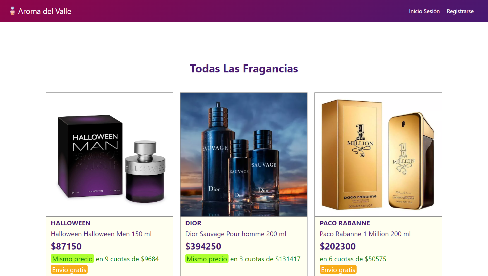

# Aroma del Valle

Aplicación web desarrollada para gestionar información relacionada con perfumes. La arquitectura de la aplicación se basa en microservicios y sigue un enfoque de desarrollo moderno utilizando tecnologías como Spring Boot para el backend y React.js para el frontend.

## Tabla de Contenidos

1. [Requisitos](#requisitos)
2. [Configuración del Entorno](#configuración-del-entorno)
3. [Estructura del Proyecto](#estructura-del-proyecto)
4. [Cómo Ejecutar](#cómo-ejecutar)
5. [Contribuciones](#contribuciones)
6. [Licencia](#licencia)

## Requisitos

- Docker
- Maven
- Java 17
- Node.js
- React.js

## Configuración del Entorno

### Base de Datos MySQL

Este proyecto utiliza MySQL como base de datos. Puedes configurar la conexión en el archivo de propiedades de cada microservicio.

### Docker y docker-compose

El entorno de desarrollo utiliza contenedores Docker para la base de datos MySQL y docker-compose para orquestar los contenedores. Asegúrate de tener Docker y docker-compose instalados en tu máquina.

### Backend

El backend está desarrollado con Spring Boot y Maven. Puedes importar cada microservicio como un proyecto Maven en tu IDE preferido.

### Frontend

El frontend está desarrollado con React.js. Puedes instalar las dependencias y ejecutar el proyecto usando npm o yarn.

## Estructura del Proyecto

- `gateaway/`: Microservicio de enrutamiento.
- `microservicio_usuario/`: Microservicio de registro y autenticación de usuarios.
- `microservicio_perfumes/`: Microservicio CRUD de perfumes.
- `frontend/`: Código fuente del frontend React.js.

## Cómo Ejecutar

1. Clona este repositorio en tu máquina local.
2. Navega a la carpeta del proyecto clonado.
3. Ejecuta `docker-compose up -d` para levantar los contenedores de MySQL.
4. Importa cada microservicio en tu IDE y ejecútalos.
5. Navega a la carpeta `frontend/`.
6. Ejecuta `npm install` para instalar las dependencias.
7. Ejecuta `npm start` para iniciar el servidor de desarrollo de React.

## Contribuciones

Las contribuciones son bienvenidas. Si deseas contribuir al proyecto, por favor sigue estos pasos:

1. Haz un fork del repositorio.
2. Crea una nueva rama (`git checkout -b feature/feature-name`).
3. Realiza tus cambios y haz commits (`git commit -am 'Add new feature'`).
4. Sube tus cambios (`git push origin feature/feature-name`).
5. Abre un pull request.

## Licencia

Este proyecto está bajo la Licencia [MIT](LICENSE).

## Demostración

¡Mira una demostración del software en acción!

